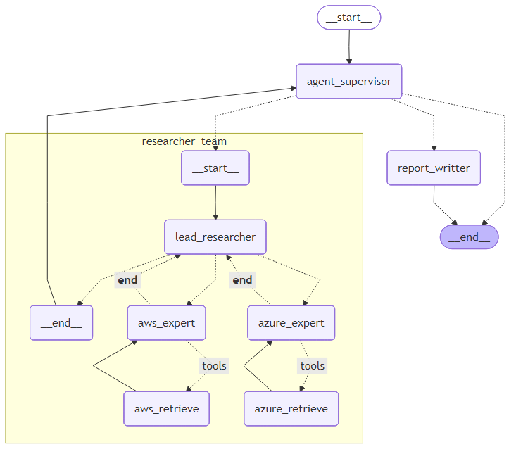

# Cloud Provider Research Agent – AI Orchestrated Multi-Expert System

## 1. Project Overview
This repository contains a modular agentic AI system designed to answer analytical and technical questions about major cloud providers—currently Azure, AWS, and GCP. The solution uses a LangGraph-based orchestration layer that classifies user intent, routes the query to the appropriate team member cloud-specific research team, aggregates the findings, and generates a structured final report.

Each cloud provider expert under the team lead uses a different retrieval strategy:

| Provider  | Retrieval Method                         |
| --------- | ---------------------------------------- |
| **Azure** | RAG with ChromaDB (local vector store)   |
| **AWS**   | JSON-based local API mock                |
| **GCP**   | Tool call that simulates an external API |

The orchestrator delegates user questions to the correct expert(s), consolidates the findings, and returns a synthesized report.

## 📐 System Architecture Overview 



The system supports real-time chat via WebSocket and REST API interaction using a FastAPI server.

------------------------------------------------------------------------

## 🚀 Setup Instructions

### 1. Create a Virtual Environment and Install Dependencies

``` bash
python3 -m venv venv
source venv/bin/activate     # Linux/Mac
venv\Scripts\activate      # Windows

pip install -r requirements.txt
```

------------------------------------------------------------------------

### 2. Configure Environment Variables (Required)

In the project root, locate the file:

    .env-example

Rename it to:

    .env

Then open the file and paste your OpenAI API key:

``` ini
OPENAI_API_KEY="<paste_openai_key_here>"
```

This key is required for all LLM operations.

------------------------------------------------------------------------

### 3. Prepare RAG Data (Required Before Running the Agent)

The Azure expert relies on a **ChromaDB vector store** built from a fake
Azure document.

Build the database:
``` bash
cd rag
python build_chroma.py
cd ..
```

------------------------------------------------------------------------

### 4. Start the Mock API for the GCP Expert
Open a new terminal and start the Mock API
``` bash
source venv/bin/activate      # Linux/Mac
venv\Scripts\activate         # Windows
python mock_api/server.py
```

------------------------------------------------------------------------

### 5. Run the FastAPI Server

After preparing the RAG data and mock API:

``` bash
cd app
uvicorn server:app --port 8000
```

The server provides:

-   **`/ws`** -- Real-time chat via WebSocket\
-   **`/completions`** -- REST API endpoint

------------------------------------------------------------------------

##  💬 Chat with agent

### 1. Using the REST API

Using REST API will show all the information in the logs related to agent internal communication.
Also it includes on the reponse the source data used to answer the user question.

### POST /completions

``` json
{
  "messages": [
    "Monte um relatório que mostre o preço médio de GPUs na AWS, Azure e GCP, e sugira a opção mais barata por hora de uso"
  ],
  "thread_id": "12345"
}
```

### 2. Using WEB Interface

Copy the link below to the web browser and interact to see the real time agent response:
```
http://127.0.0.1:8000
```


------------------------------------------------------------------------

## 🧠 Key Features

-   Multi-agent architecture with orchestrator, researchers, and report
    writer\
-   Three different retrieval strategies (RAG, JSON API, external tool)\
-   Intent classification for routing\
-   Real-time chat via WebSocket\
-   REST API for automation\
-   Embedding + vector DB pipeline using ChromaDB\

------------------------------------------------------------------------

## 📚 Future Improvements

-   Add new cloud providers\
-   Replace mock APIs with actual cloud SDK calls\
-   Add UI for research explainability